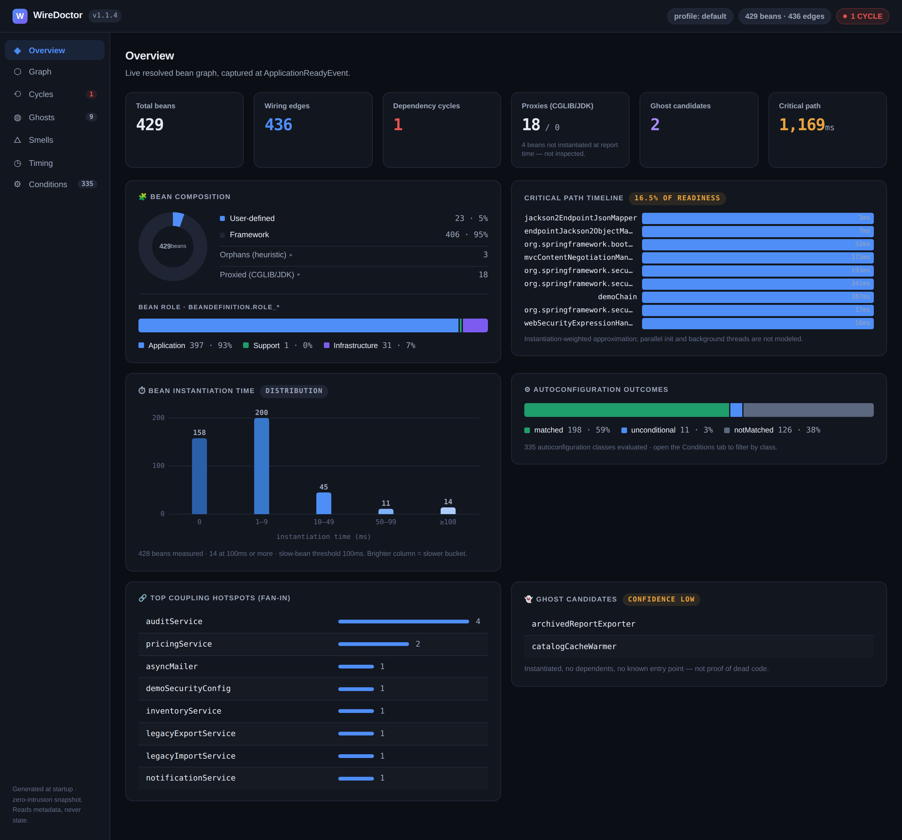

# 🩺 WireDoctor

[](https://central.sonatype.com/artifact/io.github.ddsha441981/wiredoctor-autoconfigure) [](https://github.com/ddsha441981/wiredoctor/actions/workflows/compat.yml) [](https://github.com/ddsha441981/wiredoctor/actions/workflows/compat.yml) [](LICENSE) [](https://github.com/akullpp/awesome-java#architecture)

> *"Your bean graph has a story. WireDoctor reads it."*

WireDoctor is a runtime diagnostic and architectural analysis tool for Spring Boot. Add one dependency — it hooks into the real, resolved `ApplicationContext` at startup and turns it into an interactive report, honest advice, and CI gates. **Zero-intrusion, zero-dashboard-server, pure insights.**



*Captured from a real run against start.spring.io (Boot 4.0.x, 390 beans) with performance gates armed — the red `GATE FAIL` chip is a genuinely tripped gate. **[View the full docs →](https://ddsha441981.github.io/wiredoctor/)***

**[▶ Open this exact report live in your browser](https://ddsha441981.github.io/wiredoctor/sample/test2/wiredoctor-report.html)** — no install needed.

---

## Quick start

Add the dependency — that's it. WireDoctor runs at startup, writes `wiredoctor-report.html` + `wiredoctor-report.json`, and prints a diagnostic summary to your logs.

**Maven:**
```xml
<dependency>
    <groupId>io.github.ddsha441981</groupId>
    <artifactId>wiredoctor-autoconfigure</artifactId>
    <version>1.1.0</version>
</dependency>
```

**Gradle:**
```groovy
implementation 'io.github.ddsha441981:wiredoctor-autoconfigure:1.1.0'
```

Want CI gates? Capture a baseline once, commit it, arm the gates:

```bash
./mvnw spring-boot:run \
  -Dspring-boot.run.arguments="--wiredoctor.baseline=wiredoctor-baseline.json --wiredoctor.baseline-write=true"
git add wiredoctor-baseline.json && git commit -m "chore: WireDoctor baseline"
```

```properties
# application-ci.properties
wiredoctor.baseline=wiredoctor-baseline.json
wiredoctor.fail-on=new-cycle,startup-time,slow-bean
```

Common knobs (`wiredoctor.scan-packages`, thresholds, output path, production kill-switch `wiredoctor.enabled=false`) are in the **[configuration reference](https://ddsha441981.github.io/wiredoctor/configuration.html)**.

---

## Supported Versions

The full test suite runs against this matrix in CI ([compat.yml](.github/workflows/compat.yml)); the table below reflects what is actually green:

| Spring Boot | Java 17 | Java 21 | Java 25 |
|-------------|:-------:|:-------:|:-------:|
| 2.7.x       | ✅      | ✅      | ✅      |
| 3.3.x       | ✅      | ✅      | ✅      |
| 3.5.x       | ✅      | ✅      | ✅      |
| 4.0.x       | ✅      | ✅      | ✅      |

Notes:
- **Floor is Boot 2.4**: startup timings need `BufferingApplicationStartup`, introduced in Boot 2.4. Lines older than 2.7 are not CI-verified.
- Boot lines between the tested ones (3.0–3.2, 3.4) are expected to work since WireDoctor only uses stable APIs, but only the listed lines carry a CI guarantee.
- WireDoctor itself is compiled for **Java 17** bytecode.
- **WebFlux (reactive, Netty)**: verified since v0.8.0 — `RouterFunction`, `WebHandler`, `WebSocketHandler` and `WebExceptionHandler` beans are recognized as entry points (never flagged as ghosts).

---

## 📚 Full documentation

| Guide | What it covers |
|-------|----------------|
| [Report tour](https://ddsha441981.github.io/wiredoctor/report-tour.html) | Every tab of the HTML console, explained with real screenshots |
| [Configuration reference](https://ddsha441981.github.io/wiredoctor/configuration.html) | Every property, grouped by feature, with defaults |
| [CI gating](https://ddsha441981.github.io/wiredoctor/ci-gating.html) | Fail your PR on a new bean cycle — the full workflow |
| [Performance gates](https://ddsha441981.github.io/wiredoctor/performance-gates.html) | Startup-time and slow-bean gates, thresholds, noise tolerance |
| [Upgrade Guard](https://ddsha441981.github.io/wiredoctor/upgrade-guard.html) | Catching silent autoconfiguration changes across Boot upgrades |
| [Ghost Detector](https://ddsha441981.github.io/wiredoctor/ghost-detector.html) | Passive candidates + opt-in first-touch tracking, and their trust postures |
| [Thread Distribution](https://ddsha441981.github.io/wiredoctor/thread-distribution.html) | Per-thread bean map with donut chart (v1.1.0) |
| [Startup Time Trend](https://ddsha441981.github.io/wiredoctor/startup-time-trend.html) | trendHistory in baseline + trend chart with verdict bands (v1.1.3) |
| [Security posture](https://ddsha441981.github.io/wiredoctor/security-posture.html) | What the reports expose, offline-only network behavior |
| [Known Limitations](https://ddsha441981.github.io/wiredoctor/known-limitations.html) | Honest heuristics and what the tool cannot guarantee |

Pre-generated sample reports (from real apps, including start.spring.io) are in [`sample/`](sample/) — or **[view the start.spring.io report live](https://ddsha441981.github.io/wiredoctor/sample/test2/wiredoctor-report.html)** without cloning anything.

---

## 🤝 Contributing

Contributions are welcome — bug reports, docs, tests, and features. See **[CONTRIBUTING.md](CONTRIBUTING.md)** for build/test conventions and the zero-intrusion design posture. New here? Look for issues labelled [`good first issue`](https://github.com/ddsha441981/wiredoctor/labels/good%20first%20issue).

Maintained by **[Deendayal Kumawat](https://github.com/ddsha441981)** · [LinkedIn](https://www.linkedin.com/in/deendayal-kumawat/) · [deendayal_kumawat@hotmail.com](mailto:deendayal_kumawat@hotmail.com)

## 📄 License

Dual-licensed under [MIT](LICENSE) OR Apache-2.0 — pick whichever suits your project.
