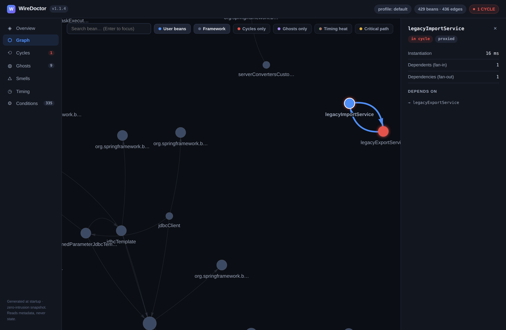
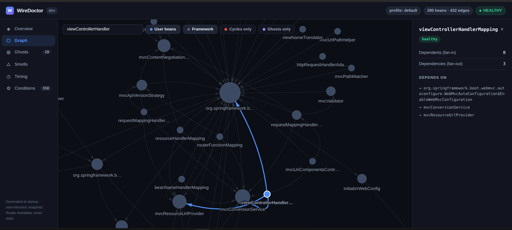
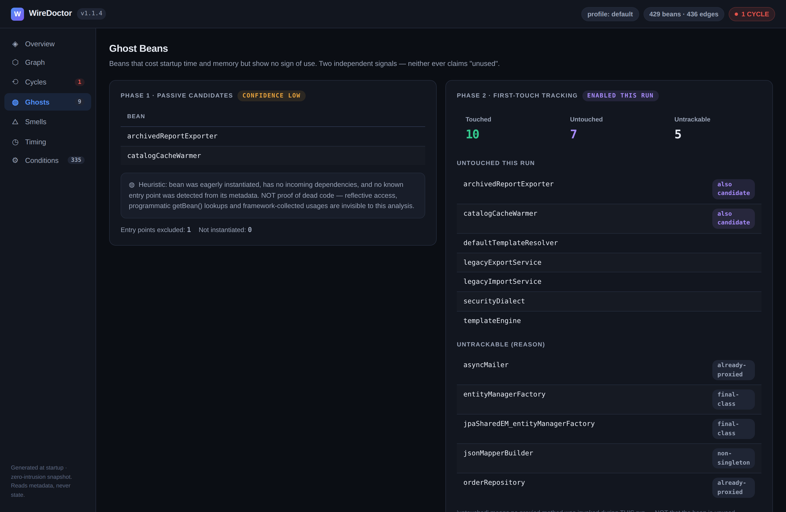
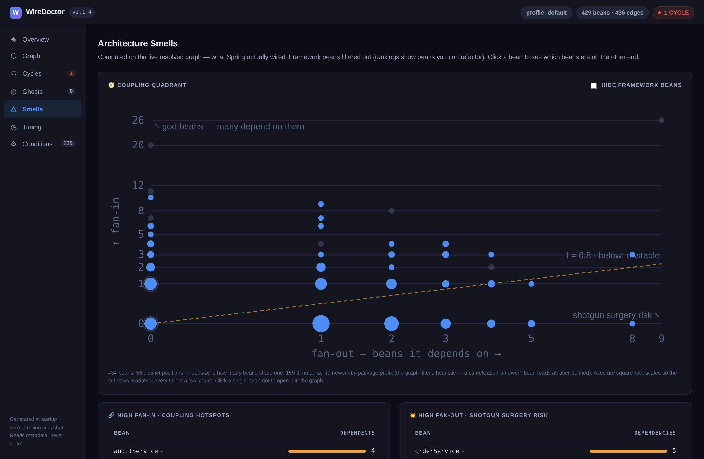
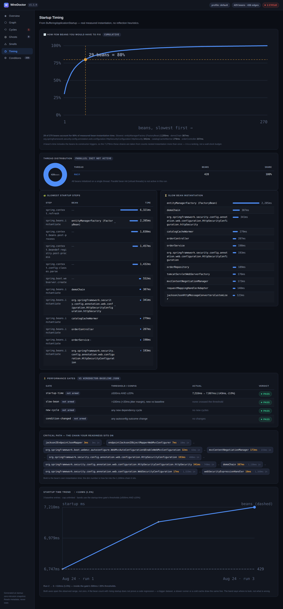
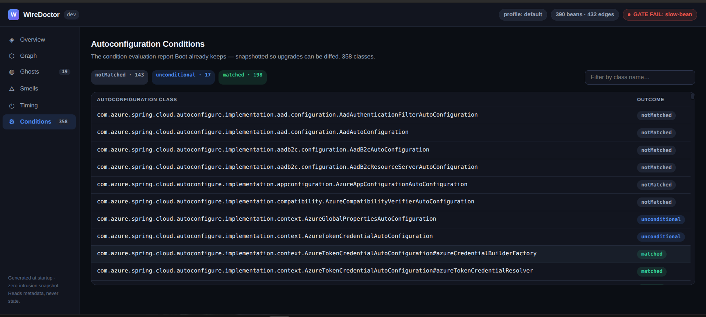

# 📸 WireDoctor Report Tour

A guided walkthrough of the WireDoctor HTML console, tab by tab. All screenshots are from a **real run against start.spring.io** (Spring Initializr, Spring Boot 4.0.x, 390 beans, 432 wiring edges) with WireDoctor **0.7.1** and performance gates armed (`wiredoctor.fail-on=startup-time,slow-bean`) — not a staged demo. The full sample reports are in [`sample/`](../sample/).

The report is a single self-contained `wiredoctor-report.html` — the graph library is inlined at generation time, so it renders completely offline. Just open it in a browser.

---

## Overview tab

The landing tab — everything at a glance:

- **Header chips (top-right)**: active profile, bean/edge counts, and the health verdict chip. Here it shows **`GATE FAIL: slow-bean`** in red — the armed `slow-bean` performance gate tripped on this run (a bean crossed the 100ms threshold that wasn't slow in the baseline). The chip follows a strict precedence: `GATE FAIL` → `N CYCLES` → `GATES PASS` → `HEALTHY`, so the worst news always wins.
- **Stat cards**: total beans (390), wiring edges (432), dependency cycles (0), CGLIB/JDK proxies (3), ghost candidates (19), and the startup critical path cost (913ms).
- **Bean composition**: user-defined vs framework beans (55 vs 335 here — a typical real app is mostly framework), plus the heuristic orphan count.
- **Startup critical path**: the single most expensive dependency chain to readiness — here `InitializrProperties → initializrMetadataProvider → bomRangesInfoContributor` accounts for 16.3% of startup. This is where a `@Lazy` or a lighter bean pays off most.
- **Top coupling hotspots** and a **ghost candidates** preview round out the page.

The sidebar footer states the trust posture: *generated at startup, zero-intrusion snapshot — reads metadata, never state*.

---

## Graph tab

The full resolved dependency graph, rendered interactively. Filter chips toggle **User beans / Framework / Cycles only / Ghosts only**, and the search box focuses any bean by name.

Two more chips bring startup timing into the graph (v0.10.0):

- **Timing heat** — recolors nodes green→red (log scale) and scales their size by per-bean instantiation time, so expensive beans jump out at a glance. Off by default; cycle/ghost/proxy/orphan colors keep priority.
- **Critical path** — traces the startup critical path in gold and dims everything else, matching the chain shown in the Timing tab. Hidden when no timing data was captured.

The screenshot above (from the demo app) shows the killer feature: **circular dependencies are highlighted in red** — `alphaBean ⇄ betaBean` jump out instantly even in a busy graph. Spring may resolve such cycles at runtime via proxies or setter injection, but they remain structural design smells, and WireDoctor's Tarjan SCC detector finds them regardless of how Spring papered over them.

Clicking a node opens the **inspector panel**: health status, instantiation time (when captured), an `on critical path` tag, fan-in (dependents), fan-out (dependencies), and the exact list of beans it depends on. Here `viewControllerHandlerMapping` is focused — its 3 outgoing edges are highlighted in blue while the rest of the graph dims. This is how you answer "what actually depends on this bean?" without grepping.

---

## Ghosts tab

Beans that cost startup time and memory but show no sign of use. Two independent signals, honestly separated:

- **Phase 1 — Passive candidates (always on)**: beans that are eagerly instantiated ∧ have zero incoming dependencies ∧ expose no detectable entry point (`@Controller`, `@Scheduled`, `CommandLineRunner`, listeners, …). Deliberately labeled **`CONFIDENCE LOW`** — it's a static signal. On start.spring.io it flags 19 candidates, mostly version-customizer beans that are genuinely wired through non-graph mechanisms — exactly why the confidence label exists.
- **Phase 2 — First-touch tracking (opt-in)**: the right card explains how to enable `wiredoctor.ghost-tracking.enabled=true` (dev/staging only), which wraps beans in a thin counting proxy and reports touched/untouched at shutdown, or live via `/actuator/wiredoctor/ghosts`.

WireDoctor never claims "unused" — only "never invoked during this run". The distinction is printed right in the UI.

---

## Smells tab

Architecture smells computed on the **live resolved graph** — what Spring actually wired, not what the source suggests. Framework beans are filtered out of the rankings so every row is something you can actually refactor:

- **High fan-in · coupling hotspots**: beans the most others depend on. A change here ripples widest — here `AzureTokenCredentialAutoConfiguration` (8 dependents) and `initializrMetadataProvider` (6) top the list.
- **High fan-out · shotgun surgery risk**: beans that depend on the most others — they break when any of their many dependencies change.

---

## Timing tab

Real measured startup numbers from `BufferingApplicationStartup` — no reflection heuristics:

- **Slowest startup steps**: the Boot lifecycle phases, with `spring.context.refresh` (4,619ms) at the top and individual `spring.beans.instantiate` steps below.
- **Slow bean instantiation**: every bean over the `slow-bean-threshold-ms` (default 100ms), ranked. On this run, `bomRangesInfoContributor` (315ms) and `initializrMetadataProvider` (313ms) lead.

Since v0.7.1, this tab also hosts the **Performance Gates card**: each gate (startup-time, slow-bean, new-cycle, condition-changed) with its threshold, actual value, and a PASS/FAIL/NOT RUN verdict chip — plus `not armed` tags and a CI hint when gates aren't configured. This is the UI counterpart of `wiredoctor.fail-on` CI gating (see the [Performance Gates guide](performance-gates.md)).

---

## Conditions tab

Spring Boot's **condition evaluation report**, snapshotted into the report — 358 autoconfiguration classes here, each tagged `matched` / `notMatched` / `unconditional`, with count chips and a class-name filter.

Why snapshot something Boot already keeps? Because a snapshot can be **diffed**. Commit it in your baseline and a Boot upgrade that silently flips an autoconfiguration from `matched → notMatched` is caught in CI with the exact condition message — before you debug the mystery of the vanished bean. See the [Upgrade Guard guide](upgrade-guard.md).

---

## Try it yourself

Open the pre-generated reports in [`sample/`](../sample/) in any browser, or add the dependency to your own app — the report appears in your working directory on next startup. See [Quick start](../README.md#-quick-start).
