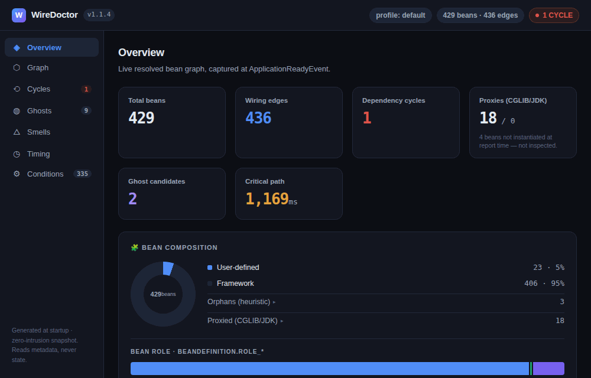
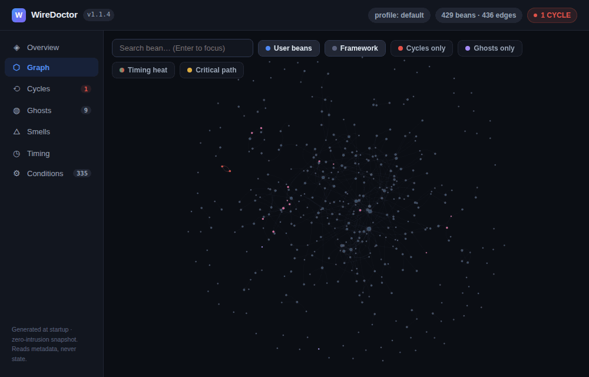
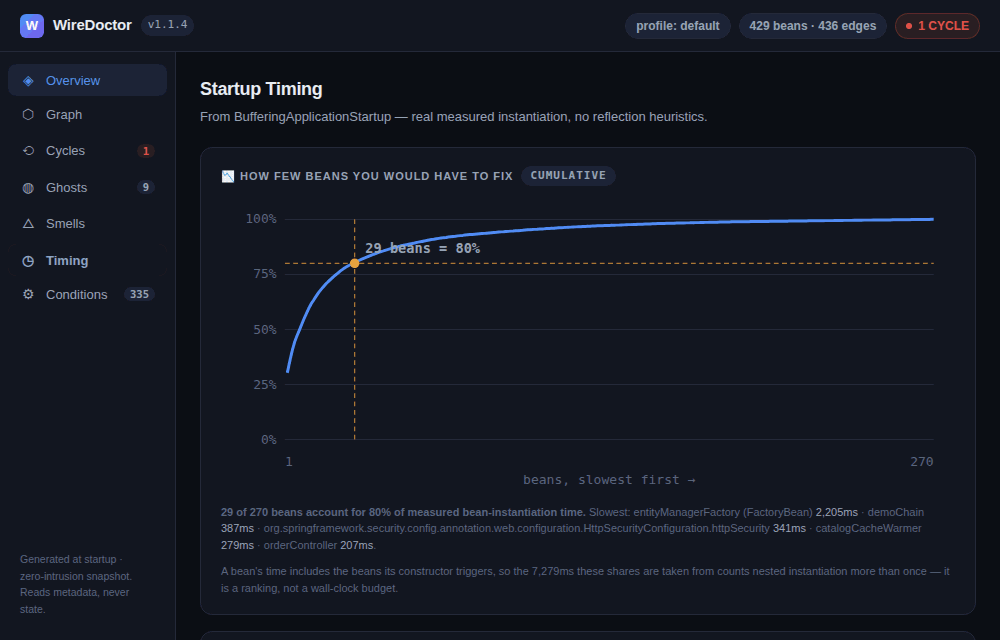

# 📸 WireDoctor Report Tour

A guided walkthrough of the WireDoctor HTML console, tab by tab. Every screenshot and GIF here is from a **real run against start.spring.io** (Spring Initializr app, Spring Boot 4.1.x, 429 beans, 436 wiring edges) on WireDoctor **1.1.4**, with a committed baseline and gates armed — not a staged demo. The app carries a deliberate circular dependency, a slow `@PostConstruct` bean and an unused exporter, so the diagnostics have something real to find. The full sample report set is in [`sample/v1.1.4/`](https://github.com/ddsha441981/wiredoctor/tree/main/sample/v1.1.4).

The report is a single self-contained `wiredoctor-report.html` — the graph library is inlined at generation time, so it renders completely offline. Just open it in a browser.

---

## Overview tab

The landing tab — everything at a glance:

- **Header chips (top-right)**: version, active profile, bean/edge counts, and the health verdict chip. Here it shows **`1 CYCLE`** in red. The chip follows a strict precedence: `GATE FAIL` → `N CYCLES` → `GATES PASS` → `HEALTHY`, so the worst news always wins.
- **Stat cards**: total beans (429), wiring edges (436), dependency cycles (1), CGLIB/JDK proxies (18), ghost candidates (2), and the startup critical path cost (1,169ms).
- **Bean composition**: user-defined vs framework beans (23 vs 406 here — a typical real app is mostly framework), the heuristic orphan count, and the `BeanDefinition.ROLE_*` split.
- **Critical path timeline**: the single most expensive dependency chain to readiness — here a Spring Security chain ending in `webSecurityExpressionHandler` accounts for 16.5% of startup. This is where a `@Lazy` or a lighter bean pays off most.
- **Bean instantiation time distribution** and **autoconfiguration outcomes** (198 matched · 11 unconditional · 126 notMatched of 335 classes) round out the page.

The sidebar footer states the trust posture: *generated at startup, zero-intrusion snapshot — reads metadata, never state*.

---

## Graph tab

The full resolved dependency graph, rendered interactively. Filter chips toggle **User beans / Framework / Cycles only / Ghosts only**, and the search box focuses any bean by name.

Two more chips bring startup timing into the graph (v0.10.0):

- **Timing heat** — recolors nodes green→red (log scale) and scales their size by per-bean instantiation time, so expensive beans jump out at a glance. Off by default; cycle/ghost/proxy/orphan colors keep priority.
- **Critical path** — traces the startup critical path in gold and dims everything else, matching the chain shown in the Timing tab. Hidden when no timing data was captured.

The screenshot above shows the killer feature: **circular dependencies are highlighted in red** — `legacyImportService` and `legacyExportService` jump out instantly even in a 429-bean graph. Spring resolved this one at runtime through setter injection, but it remains a structural design smell, and WireDoctor's Tarjan SCC detector finds it regardless of how Spring papered over it.

Clicking a node — or searching for one and pressing Enter — opens the **inspector panel**: health status, instantiation time (when captured), an `on critical path` tag, fan-in (dependents), fan-out (dependencies), and the exact list of beans it depends on. Here `orderService` is focused: its 5 outgoing edges are highlighted in blue while the rest of the graph dims. This is how you answer "what actually depends on this bean?" without grepping.

---

## Ghosts tab

Beans that cost startup time and memory but show no sign of use. Two independent signals, honestly separated:

- **Phase 1 — Passive candidates (always on)**: beans that are eagerly instantiated ∧ have zero incoming dependencies ∧ expose no detectable entry point (`@Controller`, `@Scheduled`, `CommandLineRunner`, listeners, …). Deliberately labeled **`CONFIDENCE LOW`** — it's a static signal. On this run it flags 2 candidates: `archivedReportExporter`, which genuinely nothing calls, and `catalogCacheWarmer`, which is wired through a lifecycle callback rather than the graph — exactly why the confidence label exists.
- **Phase 2 — First-touch tracking (opt-in)**: with `wiredoctor.ghost-tracking.enabled=true` (dev/staging only) WireDoctor wraps eligible beans in a thin counting proxy and reports touched/untouched at shutdown, or live via `/actuator/wiredoctor/ghosts`. Here 17 beans were tracked, 10 touched by a couple of HTTP calls and 7 untouched; 5 more were **untrackable**, each with its reason printed (`asyncMailer: already-proxied`, `entityManagerFactory: final-class`, …), and 391 framework beans were skipped.

WireDoctor never claims "unused" — only "never invoked during this run". The distinction is printed right in the UI.

---

## Smells tab

Architecture smells computed on the **live resolved graph** — what Spring actually wired, not what the source suggests. Framework beans are filtered out of the rankings so every row is something you can actually refactor:

- **High fan-in · coupling hotspots**: beans the most others depend on. A change here ripples widest — here `auditService` (4 dependents) tops the list, followed by `pricingService` (2).
- **High fan-out · shotgun surgery risk**: beans that depend on the most others — they break when any of their many dependencies change. `orderService` leads with 5.
- **Who is on the other end (v1.1.3)**: every row in both tables expands to the actual beans it is coupled to, so "fan-in 4" no longer means tracing four edges in the graph by hand.

Above the tables sits the **coupling quadrant** (v1.1.3) — a fan-out vs fan-in scatter of every bean, so you see the shape the two top-10 lists hide:

- **Up the left edge**: god beans — high fan-in, low fan-out. Many beans depend on them, so a change ripples widest.
- **Along the bottom**: shotgun-surgery risks — high fan-out, low fan-in.
- The dashed **I = 0.8** line is the same instability threshold the *Unstable beans* table uses; everything below it is unstable. Here `orderService` (I = 0.83) and `orderRepository` (I = 0.80) sit above it.
- Dot size is how many beans share that exact position, framework beans are dimmed (with a **Hide framework beans** toggle), and clicking a dot that holds a single bean opens it in the Graph tab.
- Axes are square-root scaled so a 400-bean tail stays readable — but every tick is a real count, not a bucket.

---

## Timing tab

Real measured startup numbers from `BufferingApplicationStartup` — no reflection heuristics:

- **How few beans you would have to fix (v1.1.3)**: a Pareto curve of cumulative bean-instantiation time with the 80% knee marked — on this run, **29 of 270 beans** carry 80% of it. The caption is explicit that a bean's time includes the beans its constructor triggers, so the total counts nested instantiation more than once: it is a ranking of where to look, not a wall-clock budget.
- **Thread distribution (v1.1.0)**: which threads actually instantiated beans. Here all 428 measured beans initialized on `main` — the card says *parallel init not active* rather than implying concurrency that isn't there.
- **Slowest startup steps**: the Boot lifecycle phases, with `spring.context.refresh` (6,321ms) at the top and individual `spring.beans.instantiate` steps below. Since v1.1.3 the bean each `instantiate` step created is its own column, so a step no longer names a phase without naming what it built.
- **Slow bean instantiation**: every bean over the `slow-bean-threshold-ms` (default 100ms), ranked. On this run `entityManagerFactory` (2,205ms) leads, with the deliberately sleepy `catalogCacheWarmer` (279ms) further down.
- **Performance gates** (since v0.7.1): each gate (startup-time, slow-bean, new-cycle, condition-changed) with its threshold, actual value, and a PASS/FAIL/NOT RUN verdict chip — plus `not armed` tags and a CI hint when gates aren't configured. This is the UI counterpart of `wiredoctor.fail-on` CI gating (see the [Performance Gates guide](performance-gates.html)).

The **startup time trend** chart closes the tab: startup time plus a dashed bean-count line, with a coloured band on every interval that crosses the `startup-time` gate's thresholds — red when a slowdown is *unexplained by bean count*, amber when the app also grew, green when it got faster. Here three baseline writes show +110ms (1.5%), well inside the gate's thresholds, so no band is drawn. See the [Startup Time Trend guide](startup-time-trend.html) for the verdict rules and the caveats they carry.

---

## Conditions tab

Spring Boot's **condition evaluation report**, snapshotted into the report — 335 autoconfiguration classes here, each tagged `matched` / `notMatched` / `unconditional`, with count chips and a class-name filter.

Why snapshot something Boot already keeps? Because a snapshot can be **diffed**. Commit it in your baseline and a Boot upgrade that silently flips an autoconfiguration from `matched → notMatched` is caught in CI with the exact condition message — before you debug the mystery of the vanished bean. See the [Upgrade Guard guide](upgrade-guard.html).

---

## Try it yourself

Open [this exact report live](https://ddsha441981.github.io/wiredoctor/sample/v1.1.4/wiredoctor-report.html), grab the whole set from [`sample/v1.1.4/`](https://github.com/ddsha441981/wiredoctor/tree/main/sample/v1.1.4), or add the dependency to your own app — the report appears in your working directory on next startup. See [Quick start](https://github.com/ddsha441981/wiredoctor#-quick-start).
